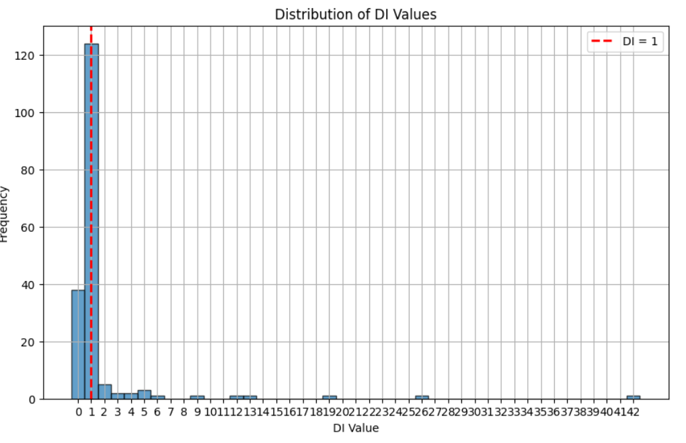

# Promovendo a Conformidade em Operações de Venda a Termo: Percepções do Aprendizado por Reforço em Ambientes Não-Determinísticos

**Autores:** 

Elias Biondo, Felipe Sampaio, Frederico Schur, Iago Tavares, Raphael Lisboa, Sarah Ribeiro e Vinicius Santos. 

**Palavras-chave:** 

Aprendizado por Reforço, Conformidade Financeira, Vendas a Termo, Compras à Vista, Taxa DI, Espaço Combinatório Não-Determinístico, Operações Financeiras, Remuneração de Cotistas, Prevenção de Transferência de Riqueza Indevida, Ambientes Financeiros Não-Determinísticos

## Abstract

This paper explores the application of Reinforcement Learning (RL) to enhance compliance in forward sale operations within non-deterministic financial environments. Focusing on transactions that combine forward sales with spot purchases aimed at the DI rate, we investigate how RL can be employed to navigate the complex, non-deterministic combinatorial space of these transactions, with the goal of ensuring financial compliance and preventing undue wealth transfer. Drawing on a theoretical foundation supported by significant advances in the field of RL, including Deep Q-Networks (Mnih et al., 2013) and AlphaGo Zero (Silver et al., 2017), along with specific insights into its application in financial markets (Meng & Khushi, 2019; Sun et al., 2023), we develop a robust model capable of precisely identifying and distinguishing these financial operations. Our study contributes to the field by demonstrating how RL techniques can be adapted to optimize trading and compliance strategies in complex, dynamic financial markets, offering valuable insights for researchers, regulators, and finance professionals.

## Introdução

Navegar pela complexa malha das operações financeiras, com o foco específico em combinar vendas a termo com compras à vista sucedidas estritamente para tal fim, levando em consideração unicamente a premissa de que operações dessa natureza visam a taxa DI (Depósito Interbancário), apresenta um desafio notável dentro do panorama financeiro contemporâneo. Este trabalho visa desvendar este desafio recorrendo ao Aprendizado por Reforço (Reinforcement Learning - RL), operando dentro de um cenário marcado por sua indefinição combinatória e natureza não-determinística, conforme explorado por Chakraborty (2019)[^1]. A intricada tarefa não se limita apenas à identificação e associação precisa dessas operações financeiras mas se estende à crucial distinção destas de outras transações movidas por diferentes intenções, tais como investimentos de longa duração. Tal contexto demanda a construção de um modelo robusto que não só garanta a conformidade dos relatórios financeiros e a equidade na remuneração de cotistas de fundos de investimento mas também se alinhe estritamente às regulamentações estabelecidas, evitando assim, desvios indevidos de recursos e prevenindo transferências indevidas de riqueza.

A aplicação do RL em mercados financeiros é um campo em rápida expansão, impulsionado por avanços recentes em algoritmos de RL profundo. Mnih et al. (2013)[^2] demonstraram a capacidade do Deep Q-Networks (DQN) de aprender políticas de controle eficazes em ambientes complexos, jogando jogos do Atari diretamente a partir dos pixels da tela. Esta descoberta sublinha o potencial do RL em aprender e tomar decisões baseadas em observações de alta dimensão, um aspecto crucial para a análise de mercados financeiros. Além disso, Silver et al. (2017)[^3] alcançaram um marco ao desenvolver o AlphaGo Zero, um sistema capaz de dominar o jogo de Go sem conhecimento prévio humano, apenas através do reforço auto-supervisionado e da busca em árvore Monte Carlo. Este avanço ilustra a capacidade do RL de resolver problemas de otimização sequencial complexos, um elemento central na combinação de operações financeiras para conformidade.

Adicionalmente, a pesquisa realizada por OpenAI et al. (2020)[^4] evidencia a versatilidade do RL em aplicar aprendizagem de políticas de controle em domínios físicos complexos, sugerindo que técnicas similares podem ser adaptadas para otimizar estratégias de negociação e alocação de ativos em mercados financeiros. Esses estudos formam a base teórica para explorar o RL no contexto de combinação de vendas a termo e compras à vista, destacando a capacidade do RL de adaptar-se e tomar decisões em ambientes incertos e dinâmicos.

Meng e Khushi (2019)[^5] fornecem insights específicos sobre a aplicação do RL em mercados financeiros, destacando tanto o potencial quanto os desafios enfrentados na implementação prática dessas técnicas. Sun et al. (2023)[^6] avançam ainda mais, propondo uma estrutura de avaliação para métodos de FinRL que considera múltiplas dimensões de desempenho, reconhecendo a complexidade de aplicar RL em finanças.

Este artigo está estruturado para explorar o uso de RL na otimização de combinações de vendas a termo e compras à vista com foco na taxa DI. A seção 2 revisa a literatura relevante, a seção 3 detalha a metodologia empregada, a seção 4 apresenta os resultados obtidos, seguida pela discussão na seção 5, que compara nossas descobertas com trabalhos anteriores e explora suas implicações práticas. A seção 6 conclui o estudo, resumindo suas contribuições e sugerindo direções para futuras pesquisas.

## Metodologia

### Definição do problema

O problema abordado neste estudo está relacionado à  uma classe específica de ativos denominada "sintéticos de renda fixa". Esses ativos são compostos por uma posição vendida a termo de uma ação específica, combinada com uma posição comprada na mesma ação objeto de negociação do termo. A rentabilidade desses ativos sintéticos é assegurada pela diferença entre o preço do contrato a termo e o preço da negociação à vista da ação, assemelhando-se a ativos de renda fixa com taxa pré-fixada. Esta estratégia, comumente referida como "cash and carry" ou "basis trading", implica a busca por combinações ideais de negociações à vista de ações que correspondam aos contratos a termo.

O desafio reside em encontrar as combinações ideais que garantam uma rentabilidade próxima a 100% do CDI para os ativos sintéticos. Em caso de desequilíbrio, espera-se que exista uma estrutura de termo de rentabilidade, onde a relação entre o vencimento do sintético e sua rentabilidade seja não decrescente. Em outras palavras, à medida que o vencimento do sintético aumenta, espera-se que sua rentabilidade também aumente.

### Objetivos da pesquisa

Os objetivos desta pesquisa englobam três áreas-chave que visam aprimorar o processo de precificação de ativos de renda fixa sintética e otimizar as estratégias de combinação de negociações. Primeiramente, busca-se otimizar a rotina diária de precificação desses ativos, visando garantir uma análise precisa e eficiente dos elementos envolvidos. Em segundo lugar, o objetivo é realizar o casamento adequado entre as negociações à vista e os contratos a termo, buscando equilibrar as operações de forma a maximizar a rentabilidade dos ativos sintéticos. Por fim, pretende-se aplicar técnicas avançadas de Aprendizagem por Reforço (Reinforcement Learning) para aprimorar o processo de precificação e desenvolver estratégias mais eficazes de combinação de negociações. Esses objetivos são fundamentais para aprimorar a eficiência e a precisão das operações financeiras, mitigando riscos e maximizando retornos.

### Hipoteses a serem testadas

Com base no problema apresentado e nos objetivos da pesquisa, foram formuladas as seguintes hipóteses:

**Hipótese Principal:** A aplicação de técnicas de Aprendizagem por Reforço (RL) resultará em casamentos precisos de negociações à vista e contratos de venda a termo a partir dos dados disponíveis. 

**Hipótese Secundária:** A adoção de técnicas de RL reduzirá a necessidade de intervenção manual no processo de precificação, aumentando assim a eficiência e a escalabilidade das operações.

### Ambiente de simulação

**selling:** Esta chave contém uma lista de vendas a termo de diferentes ativos realizadas na data correspondente. Cada transação de venda é detalhada com informações cruciais, como o ativo envolvido, a quantidade negociada e o preço acordado. Esses dados são essenciais para entender os movimentos de venda e a demanda por determinados ativos em um determinado momento.

**purchase:** Por outro lado, esta chave guarda todas as compras efetuadas na mesma data para os ativos em questão. Da mesma forma que para as vendas, cada transação de compra é detalhada com informações similares, incluindo o ativo adquirido, a quantidade comprada e o preço de cada unidade daquele ativo. Esses dados são cruciais para analisar a oferta e a procura por ativos específicos em um determinado período de tempo.

Ao dispor os dados dessa maneira, os modelos financeiros podem ser treinados de forma mais eficaz, capturando nuances e padrões. Além disso, a estrutura de dicionários facilita a manipulação e análise dos dados durante o processo de treinamento, proporcionando uma iteração mais ágil e precisa dos modelos.

Durante cada etapa de interação com o ambiente, o agente pode tomar uma ação, que corresponde a diferentes estratégias de negociação, como realizar uma transação total ou parcial, ou pular a negociação. Cada ação resulta em uma recompensa que reflete o desempenho da ação em relação aos objetivos de maximização de lucro.

O ambiente também mantém um histórico das interações do agente, incluindo as observações, as ações tomadas e as recompensas recebidas, sendo possível visualizar informações detalhadas sobre o estado atual do ambiente, como o episódio atual, o índice atual, o estado atual da negociação e pontuação da última ação.

### Algoritmos utilizados 

Para abordar o estudo de combinação das negociações de compra a vista e venda a termo, foram aplicadas as principais técnicas de Aprendizado por Reforço (RL). Esta abordagem computacionalmente poderosa e adaptativa se mostrou promissora em resolver problemas dinâmicos e de tomada de decisão em uma ampla gama de domínios. Em nosso estudo, nos concentramos em dois algoritmos fundamentais dentro do campo do RL:

**Deep Q-Network (DQN):** É um algoritmo conhecido principalmente por sua capacidade de lidar eficazmente com espaços de ação discretos e observações contínuas, o DQN utiliza redes neurais profundas para estimar a função Q, que quantifica o valor de tomar uma determinada ação em um determinado estado. Ao acumular experiências em um buffer de replay, o DQN atualiza iterativamente os pesos da rede neural, visando minimizar a diferença entre os valores de Q previstos e os valores de Q esperados. Esta abordagem permite que o agente aprenda uma política eficaz de correspondência de ordens ao longo do tempo, adaptando-se dinamicamente às mudanças nas condições do mercado.

**Policy Gradient Methods:**   Dentro desta classe de algoritmos, destaca-se os métodos de gradiente de política, que operam diretamente na política de decisão, ajustando seus parâmetros para maximizar a recompensa esperada. Em contraste com abordagens que estimam valores de ação ou estado e derivam uma política a partir deles, os métodos de gradiente de política atualizam os parâmetros da política de forma iterativa, utilizando o gradiente da função objetivo. Isso permite que o agente aprenda uma política ótima, adaptando-se dinamicamente ao ambiente e às mudanças nas condições. Entre os métodos mais conhecidos estão o REINFORCE (Monte Carlo Policy Gradient), que utiliza amostragem Monte Carlo para estimar o gradiente da função objetivo, e o Advantage Actor-Critic (A2C), que combina elementos de métodos de política e métodos de valor para melhorar a eficácia do treinamento. Esses algoritmos são particularmente úteis em cenários com espaços de ação contínuos e estocásticos, onde métodos baseados em valores podem enfrentar dificuldades de convergência. Ao ajustar diretamente os parâmetros da política, os métodos de gradiente de política oferecem uma abordagem flexível e poderosa para resolver uma variedade de problemas de aprendizado por reforço.


### Estados

Os estados do ambiente são representados como vetores numéricos que capturam informações relevantes sobre o ambiente, como as quantidades disponíveis para negociação, diferenças de preços entre transações e outras variáveis que influenciam as decisões do agente. No caso do estudo em questão, o estado é composto pela quantidade pendente de ativos a serem combinados, a quantidade 
disponível, a quantidade de combinações e a diferença entre o preço ideal e o preço de negociação, todas as informações são referentes a uma compra específica. A função para adquirir as informações mencionadas pode ser formalizada da seguinte maneira:

```python
def get_observation(self):
        ep_data = self.pairs[self.keys[self.crr_ep]]
        crr_sal = ep_data['sale'][self.crr_ix]
        crr_pur = ep_data['purchase'].iloc[self.crr_st % ep_data['purchase'].shape[0]]

        return np.array(
            [
                crr_sal['pending_quantity'],
                crr_pur['available_quantity'],
                crr_pur['matched'],
                self.heur(crr_sal['ideal_price'], crr_pur['price'])
            ]
        )
```

### Agente 

O agente é um sistema computacional capaz de interagir com o ambiente, tomar decisões e realizar ações com o objetivo de atingir determinados objetivos ou maximizar recompensas. No estudo em questão, o agente é representado por uma rede neural implementada utilizando a biblioteca Keras. Esse modelo recebe como entrada o estado atual do ambiente e produz uma estimativa dos valores de ação para cada possível ação a ser tomada. Durante o treinamento, o agente acumula experiências em um buffer de memória, utilizando um algoritmo de reprodução para amostrar essas experiências e atualizar o modelo neural com base nas recompensas recebidas. Além disso, o agente incorpora mecanismos de exploração do ambiente, controlados por uma probabilidade de exploração, para buscar novas estratégias e evitar a estagnação em soluções subótimas. Ele também é capaz de salvar e carregar o modelo neural treinado, permitindo sua reutilização e transferência para novos cenários. Abaixo podemos acompanhar a construção de um ambiente:

```python

    def compute_action(self, state):

        if np.random.rand() < self.exploration_proba:
            return np.random.choice(self.action_size)
        q_values = self.model.predict(state.reshape(1, -1))[0]
        return np.argmax(q_values)

    def store_episode(self, state, action, reward, next_state, done):

        self.memory_buffer.append((state, action, reward, next_state, done))
        if len(self.memory_buffer) > self.max_memory_buffer:
            self.memory_buffer.pop(0)

    def replay(self):

        if len(self.memory_buffer) < self.batch_size:
            return
        batch_sample = np.random.choice(self.memory_buffer, self.batch_size)

        for state, action, reward, next_state, done in batch_sample:
            target = reward
            if not done:
                target += self.gamma * np.amax(self.model.predict(next_state.reshape(1, -1))[0])
            target_f = self.model.predict(state.reshape(1, -1))
            target_f[0][action] = target
            self.model.fit(state.reshape(1, -1), target_f, epochs=1, verbose=0)

```

Os 3 métodos acima formam o agente, que toma decisões, aprende com suas experiências passadas e melhora suas estratégias ao longo do tempo. O método *compute_action* é responsável por tomar uma decisão sobre qual ação o agente deve tomar em um determinado estado. Ele utiliza a política epsilon-greedy, escolhendo aleatoriamente uma ação com probabilidade de exploração exploration_proba ou escolhendo a ação com maior valor Q previsto pela rede neural. O método store_episode é usado para armazenar as transições de estado, ação, recompensa, próximo estado e flag de done (indicando se o episódio terminou) na memória de replay. E o *replay* é responsável por realizar o processo de replay, ou seja, atualizar os pesos da rede neural com base nas experiências armazenadas na memória de replay. Ele amostra um lote de transições aleatórias da memória de replay, calcula os alvos Q com base nas recompensas futuras esperadas, e treina a rede neural usando esses alvos.


### Ações 

As ações representam as escolhas disponíveis para um agente em um determinado estado do ambiente. Essas escolhas representam as decisões que o agente pode tomar para interagir com o ambiente e influenciar seu estado futuro. As ações são geralmente definidas com base nos objetivos específicos do problema e podem variar em natureza e complexidade, dependendo da tarefa em questão. Por exemplo, em um ambiente de jogo, as ações podem incluir movimentos de um jogador, como avançar, recuar, atacar ou defender.A escolha das ações influencia diretamente as consequências futuras e as recompensas que o agente receberá do ambiente. O objetivo do agente é aprender uma política de ação ótima que maximize sua recompensa cumulativa ao longo do tempo, adaptando suas escolhas com base nas interações com o ambiente e nas recompensas recebidas. Como por exemplo:

```python
def compute_action(self, state):

    if np.random.rand() < self.exploration_proba:
        return np.random.choice(self.action_size)
    q_values = self.model.predict(state.reshape(1, -1))[0]
    return np.argmax(q_values)

```
 O código acima permite que um agente faça escolhas de ação em um ambiente baseado em sua política de exploração e aprendizado. Primeiro, ele verifica se deve explorar ou agir de acordo com seu conhecimento atual, com base em uma probabilidade de exploração definida. Se optar pela exploração, o agente escolherá uma ação aleatória entre as disponíveis. Caso contrário, usará sua rede neural para prever os valores Q para cada ação no estado atual e selecionará a ação com o maior valor Q, seguindo sua política de escolha de ação. Essa abordagem visa equilibrar a exploração do ambiente com a exploração das melhores ações conhecidas até o momento, permitindo que o agente aprenda e melhore suas estratégias ao longo do tempo.

### Recompensas

As recompensas desempenham um papel na interação entre agentes de redes neurais e seus ambientes, representando sinais de feedback que guiam o aprendizado e a tomada de decisões. Ao quantificar o sucesso ou fracasso das ações em relação aos objetivos do sistema, as recompensas direcionam o agente a aprender políticas de ação ótimas, ajustando seus parâmetros com base nas experiências passadas e nas recompensas recebidas. Elas também definem os objetivos do agente, associando valores de recompensa a ações e estados do ambiente. Assim, as recompensas são essenciais para o treinamento eficaz de sistemas de aprendizado de máquina, mas requerem formulação cuidadosa para evitar comportamentos indesejados.

No caso do estudo em questão, a recompensa é determinada com base na diferença entre a pontuação atual e a pontuação resultante de tomar uma determinada ação, bem como na diferença entre a pontuação atual e a melhor pontuação possível. A função utiliza essas diferenças para calcular a recompensa, aplicando uma função tangente hiperbólica ponderada pela magnitude da mudança na pontuação relativa à melhor pontuação possível. Se a diferença entre a melhor pontuação possível e a pontuação atual for zero, a recompensa será 0.76 se essa diferença for igual à diferença entre a pontuação atual e a pontuação resultante da ação tomada. Caso contrário, a recompensa será determinada pela função tangente hiperbólica da magnitude da mudança na pontuação em relação à melhor pontuação possível, ponderada pelo fator mr. Essa abordagem permite que o agente seja recompensado positivamente por melhorar sua pontuação em relação à melhor pontuação possível, incentivando-o a tomar ações que levem a melhores resultados. Segue o exemplo da função recompensa do projeto abaixo:

```python
def get_reward(self, diff_rh, diff_tg):

    if diff_tg == 0:
        if diff_tg == diff_rh:
            return 0.76
        else:
            return np.tanh(0.2*(self.mr * diff_rh))

    return np.tanh(0.2*(self.mr * (diff_rh/diff_tg)))  
```

A função acima calcula a recompensa com base na diferença entre diff_rh e diff_tg (taxa de di target e taxa de di da operação), que podem representar diferenças entre valores relevantes em um sistema. Se a diferença for igual a zero, a função verifica se diff_tg é igual a diff_rh e retorna uma recompensa predefinida se forem iguais; caso contrário, retorna o resultado da tangente hiperbólica de um valor calculado com base em diff_rh. Se diff_tg não for zero, a função calcula a razão entre diff_rh e diff_tg e retorna a tangente hiperbólica de um valor calculado com base nessa razão. Essa função é fundamental para avaliar a performance de ações ou decisões tomadas pelo agente em um ambiente específico, sendo essencial em algoritmos de aprendizado por reforço para determinar o sucesso ou fracasso de uma ação em relação a um objetivo definido.

## Configuração Experimental:

No desenvolvimento de sistemas de aprendizado por reforço, a configuração dos parâmetros da rede neural, como taxa de aprendizado, fator de desconto e tamanho do lote, desempenha um papel essencial. Esses parâmetros influenciam diretamente a capacidade do agente de aprender e tomar decisões eficazes no ambiente, sendo crucial seu ajuste para garantir um desempenho otimizado do sistema de inteligência artificial. Aqui estão listados os parâmetros utilizados no modelo:

- **Learning Rate (Taxa de Aprendizado):** Este parâmetro controla o tamanho dos ajustes feitos nos pesos da rede neural durante o treinamento, influenciando a rapidez com que o modelo se adapta às mudanças nos dados de entrada.

- **Gamma (Fator de Desconto):** O fator de desconto determina o quão importante são as recompensas futuras em relação às recompensas imediatas. Isso afeta diretamente como o agente avalia as ações a serem tomadas, dando mais ou menos peso às recompensas a longo prazo.

- **Probabilidade de Exploração (exploration_proba):** Esta é a probabilidade inicial com que o agente explora o ambiente em busca de novas estratégias. Uma alta probabilidade de exploração pode levar a uma exploração mais ampla do espaço de ação, enquanto uma baixa probabilidade pode resultar em exploração limitada e uma maior dependência de ações previamente aprendidas.

- **Taxa de Decaimento da Probabilidade de Exploração (exploration_proba_decay):** Este parâmetro controla como a probabilidade de exploração diminui ao longo do tempo. Uma taxa de decaimento mais lenta pode permitir que o agente continue explorando por mais tempo, enquanto uma taxa mais rápida pode levar a uma transição mais rápida para a exploração baseada em políticas aprendidas.

- **Tamanho do Lote (batch_size):** Define o número de exemplos de treinamento usados em uma única iteração do algoritmo de treinamento. Um tamanho de lote maior pode resultar em atualizações mais estáveis dos pesos da rede, enquanto um tamanho de lote menor pode fornecer uma estimativa mais granular do gradiente.

- **Buffer de Memória (memory_buffer):** Este é um buffer que armazena experiências passadas do agente, permitindo que ele faça uso delas durante o treinamento através da técnica de replay de experiência. Um tamanho adequado para o buffer de memória é crucial para garantir que o agente mantenha uma variedade suficiente de experiências passadas para um treinamento eficaz.

- **Tamanho Máximo do Buffer de Memória (max_memory_buffer):** Define a capacidade máxima do buffer de memória. Um buffer de memória muito grande pode consumir muitos recursos de memória, enquanto um buffer muito pequeno pode limitar a capacidade do agente de aprender com experiências passadas.

- **Modelo Neural (model):** Este é o modelo de rede neural que o agente utiliza para tomar decisões com base no estado atual do ambiente. A arquitetura e os parâmetros deste modelo, como o número de camadas e neurônios, têm um impacto significativo no desempenho do agente e na capacidade de generalização para diferentes cenários.


## Métricas de Avaliação:

Com base na hipótese principal de que a aplicação de técnicas de Aprendizagem por Reforço (RL) resultará em casamentos precisos de negociações à vista e contratos de venda a termo a partir dos dados disponíveis, a avaliação do desempenho dessas técnicas se torna crucial. Métricas de avaliação podem incluir a precisão na previsão dos casamentos entre negociações à vista e contratos de venda a termo, a taxa de sucesso na correspondência entre os dados históricos e as ações recomendadas pelo sistema de RL, e a capacidade do modelo em adaptar-se a mudanças nas condições do mercado ao longo do tempo. Já a hipótese secundária de que a adoção de técnicas de RL reduzirá a necessidade de intervenção manual no processo de precificação, aumentando a eficiência e a escalabilidade das operações, pode ser avaliada por métricas como o tempo necessário para realizar as correspondências de negociações, a redução na ocorrência de erros manuais e o aumento da eficiência operacional geral do sistema. Essas métricas fornecerão insights cruciais sobre o impacto das técnicas de RL na precisão, eficiência e escalabilidade das operações de precificação, validando assim as hipóteses propostas.


## Resultados 

Foram realizados alguns testes do modelo alterando diferentes parâmetros do modelo com a finalidade de analisar as consequências e o melhor ajuste daquele respectivo parâmetro para o resultado geral da rede. As variáveis que foram alteradas foram *exploration_proba_decay*, *gamma*, *learning rate* e *batch size*.

O "learning rate" (taxa de aprendizado) afeta diretamente a convergência e estabilidade do modelo durante o treinamento em aprendizado por reforço. Uma taxa alta pode resultar em atualizações de peso muito grandes, levando a oscilações ou até mesmo a divergência do modelo. Por outro lado, uma taxa baixa pode retardar o processo de aprendizado e aumentar o tempo necessário para a convergência, podendo até mesmo levar a uma convergência para uma solução subótima.

O tamanho do lote (batch size) influencia a eficiência computacional e a estabilidade do treinamento. Um tamanho de lote maior pode acelerar o treinamento, pois permite que o modelo explore mais exemplos de treinamento em paralelo. No entanto, tamanhos de lote muito grandes podem aumentar os requisitos de memória e diminuir a qualidade das atualizações devido à aleatoriedade dos exemplos em cada lote.

A "exploration_proba_decay" é um parâmetro que controla a taxa de decaimento da probabilidade de exploração em estratégias de exploração versus explotação. Um decaimento mais rápido pode incentivar o agente a explorar mais cedo em sua fase de treinamento, enquanto um decaimento mais lento pode permitir que o agente explore menos ao longo do tempo, favorecendo a exploração de ações mais confiáveis. 

Por fim, o "gamma" é o fator de desconto que determina a importância relativa das recompensas futuras em comparação com as recompensas imediatas. Um valor mais alto de gamma indica que o agente valoriza mais as recompensas futuras, o que pode levar a uma política mais de longo prazo, enquanto um valor mais baixo enfatiza mais as recompensas imediatas, resultando em uma política mais de curto prazo. 

Após diversos testes empíricos, as taxas aplicadas nos parâmetros citados foram: 

```python
learning_rate = 0.000001
batch_size = 32
gamma = 0.99
exploration_proba_decay = 0.994
```


## Conclusões 

A aplicação de métodos baseados em Aprendizado por Reforço em casamentos de operações no processo de precificação de ativos de renda fixa sintética do BTG Pactual apresentou resultados satisfatórios. 

Em uma avaliação com 200 episódios, aproximadamente 80% das combinações se situaram dentro do intervalo sugerido (entre 99% e 104% do CDI), com apenas algumas exceções ficando fora desse intervalo.




No entanto, os resultados obtidos até o momento indicam que a solução proposta necessita de melhorias. Para a melhora do resultado, é necessário um exame mais aprofundado dos parâmetros do modelo, da estrutura de dados de entrada e da adaptação do algoritmo para otimizar ainda mais o processo de precificação.


## Referências

[^1]: Chakraborty, S. (2019). Deep Reinforcement Learning in Financial Markets.
[^2]: Mnih, V., Kavukcuoglu, K., Silver, D., Graves, A., Antonoglou, I., Wierstra, D., & Riedmiller, M. (2013). Playing Atari with deep reinforcement learning. arXiv preprint arXiv:1312.5602.
[^3]: Silver, D., Schrittwieser, J., Simonyan, K., Antonoglou, I., Huang, A., Guez, A., ... et al. (2017). Mastering the game of Go without human knowledge. Nature, 550(7676), 354–359.
[^4]: OpenAI, Andrychowicz, M., Baker, B., Chociej, M., Józefowicz, R., McGrew, B., ... Zaremba, W. (2020). Learning dexterous in-hand manipulation. International Journal of Robotics Research, 39(1), 3–20.
[^5]: Meng, T. L., & Khushi, M. (2019). Reinforcement Learning in Financial Markets. Data, 4(3), 110.
[^6]: Sun, S., Qin, M., Wang, X., & An, B. (2023). PRUDEX-Compass: Towards Systematic Evaluation of Reinforcement Learning in Financial Markets. Trans. Mach. Learn. Res.
[^7]: Sutton, R. S., & Barto, A. G. (2018). Reinforcement learning: An introduction. MIT press.
[^8]: Schulman, J., Wolski, F., Dhariwal, P., Radford, A., & Klimov, O. (2017). Proximal policy optimization algorithms.


